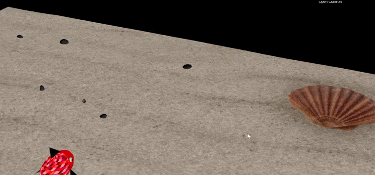

# CGRA 2020/2021

## Contribuidores

Melissa Silva

Mateus Silva

## Sobre o Projeto

Trata-se de uma aplicação gráfica em Javascript + WebGL que mostra uma cena subaquática com um peixe controlável com teclado. Mais imagens em *project/screenshots*.

Vídeos de demonstração podem ser descarreegados e vistos em: https://github.com/lessthelonely/cgra-project/tree/main/project/videos
