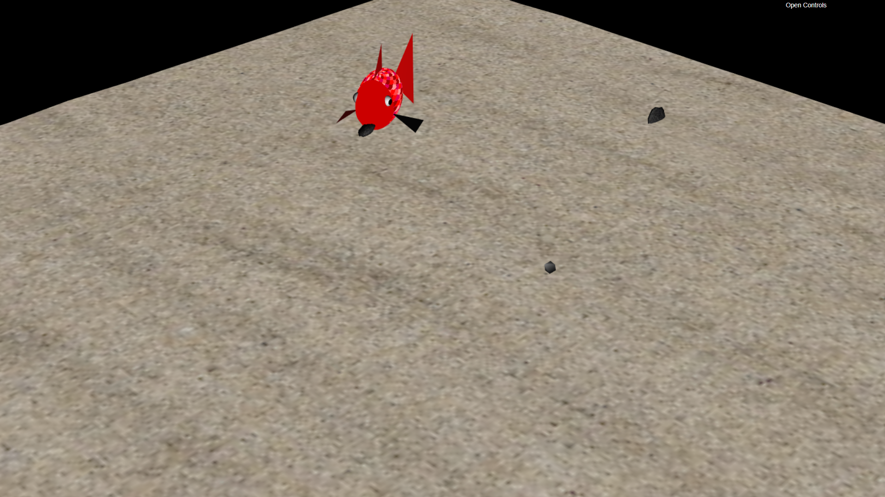
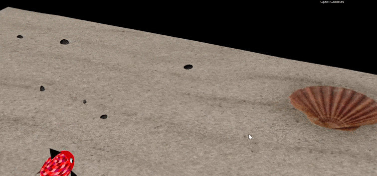

# CGRA 2020/2021

## Group T02G03

## Project Notes

For the sake of organization, we decided to not follow the project's numbering of the exercises, as we felt some parts presented as "small" were actually worthy of their own sections! We politely ask for anyone wishing to navigate this document to guide themselves through the section titles!

### **Part A**

#### **Exercise 1 - Controllable Object**

Our biggest difficulties lied in being able to center the triangle at (0, 0, 0), which was difficult to do but we decided to do it by calculating the triangle's circumcenter. After that, we had a little hard time getting what we were supposed to do, as we weren't able to fully understand the project's description - after clearing our doubts with our practical classes teacher, we found the rest rather easy.

#### **Exercise 2 - Standard Objects for the Basis (Part 1 - Cubemap)**

For the second exercise, our biggest difficulties were getting reciprocal patterns (i.e., that seamlessly connect in all their edges). We ended up doing a bonus texture of a galaxy texture that does not connect cleanly, but also a texture of a desert that was reciprocal.

#### **Exercise 3 - Standard Objects for the Basis (Part 2 - Cylinder)**

For the third exercise, our biggest difficulty was just adapting the MyPyramid class into MyCylinder - we ended up doing a rather big number of sides (as we're dealing more with a prism and not a perfect cylinder) in order to better approximate the circular base and side.

#### **Exercise 4 - Standard Objects for the Basis (Part 3 - Sphere)**

For the fourth exercise, the biggest difficulty was understanding the spherical texture coordinates.

#### **Exercise 5 - Additional Interface Controls**

The fifth exercise didn't introduce anything we hadn't seen before, so we didn't have any difficulty worth mentioning.

### **Part B**

#### **Exercise 6 - MyFish: An Artificial Fish**

In this exercise, we were asked to model a small fish, using spheres and triangles. Our first big problem came when we started doing the animations for the fins and tail - we asked for help from the teacher and after learning the principles of what to do, all the animations were easy to do. The second biggest difficulty was applying and making the texture and shader for the object work, namely keeping it only applied on the fish's body and then being able to do an approximate 40/60 between the head and the rest of the body, where the texture was supposed to be applied.

We managed it by revising what we had learned on texture and shaders and, later, to figure out the correct values, trial and error. We also did our own custom texture for the fish, nothing too elaborate, but we felt it matched the fish better, as we decided to make the fish red as shown in the instructions for Part B.

#### **Exercise 7 - Modelling Elements of the Scene**

This exercise had numerous parts, thus we're going to divide our comments according to them. We'd like to preface the following sections with this:

- We kept bouncing between exercises and progressing non-linearly;
- Whenever something we did right could be applied again (namely, getting algae/seaweed after managing to get a random rock set), we went for it;
- Photos were taken with some messing around with camera (namely, the default camera usually provided for TP classes) and the scaling (as when *scaleFactor* is at one, it was highly difficult to get the screenshots showcasing the features we wanted).

##### **Exercise 7.1 - Sand Floor**

The first part of the exercise asked for us to create a ground of sand (like in the bottom of the sea) to add to our scene, which we did. Our biggest difficulties came in the form of the shaders, namely applying the heigh map provided to give some depth to the sand texture. After understanding that, it was pretty straightforward: we only had to use Photoshop and trial and errors to get a nest we were proud of.

The nest coordinates are (45.4, 7.3) and its radius is 4.9, which checks out with the question's requirements.

##### **Exercise 7.2 - Water Surface**

The second part asked us to do a plane to be used as the top of our underwater scene - the surface of the water, as seen from below! Our difficulties lied, once again, on shaders, namely being able to apply the distortion needed to emulate water movement.

Not much else beyond that.

##### **Exercise 7.3 - Rock**

This time, we were asked to do a rock object and then a randomized rock set to place on our sand floor. As it's said in the information provided, we based ourselves in *MySphere* - the biggest difficulties came with being able to transform the rock (by vertex manipulation) in order to give it a more irregular texture. After help from our practical teacher, we managed it!

We also applied a rock texture on each rock we have! Getting the rock set was mostly a matter of generating randomness in our environment through the *Math.random()* function.

##### **Exercise 7.4 - Underwater Cubemap, Pillars and Algae**

This is a part with a few sub-parts, namely doing cylindrical pillars, a new *cubemap* and other elements. The pillars were easy after doing the cylinder from Part A: we just had to reuse the *MyCylinder* class, scale it for a bigger height and apply a texture (which we took the liberty of getting).
For the *cubemap*, we just had to add a new set of textures to apply in its sides.
Finally, the algae/seaweed was created using a similar algorithm to the rocks with added variables to "randomize", namely color and number of algae in a set.

**Photos for Point 5**

**Photos for Point 6**

#### **Exercise 8 - Additional Animations and Controls** 

Like **Exercise 7**, this exercise features different parts, which we'll discuss separately.

##### **Exercise 8.1 - MyMovingFish: Controlling a Fish Through Keyboard Input**

This first part was pretty straight-forward for us, as it only required the creation of a new subclass of *MyMovingObject*, which was already done and served as a blueprint for *MyMovingFish*: after adapting it to control the movements of an instance of *MyFish*, we merely had to add more controls - namely the *P* and *L* mentioned in the project's requisites.

No big difficulties here. The following picture shows the fish in its starting position (with SandFloor shown to help with noticing the difference);

Pressing the *L* key gives us this (no rotation or adjustment done to the screen whatsoever!).

Pressing *P* right now takes the fish back to the position in the first photo. We'd like to mention that it is also possible to make the fish go down as it's moving, as expected.

Here's all the movement, in a GIF.

##### **Exercise 8.2 - MyMovingFish: Controlling a Fish Through Keyboard Input**

The second part was a bit more difficult, as we had to structure a feasible logic to allow for the more realistic movement: this conceptualization is, however, the biggest difficulty of this part, with no more difficulties worth mentioning.

This feature can be seen in the above GIF.

##### **Exercise 8.3 - Getting Rocks**

The third and last part of this exercise was the most difficult one, namely because we found that this requisite was one that had a lot of moving parts, namely: the fish's movement (both translation and rotation) and appearance, the rocks (their position and appearance) and, of course, getting keyboard input, though we do believe this last one was the easy part.

We approached this one by landmarks, them being: getting the fish to "grab" a rock (i.e., to associate it to him), position it in its mouth, make sure it accompanied the fish's movement correctly and, finally, getting the fish to drop a previously grabbed rock. Out of these, we believe our strategy was done in pairs: first getting the fish to grab and drop a rock and then to do the needed work to position it in its mouth and make it accompany the fish correctly.

A lot of difficulties, arose, namely some very random deformations on the fish (and, sometimes, the grabbed rock), some texture problems (mostly on the rock), and finally, to make the rock's movement accompany the fish perfectly. It took a while, but we always figured out what was wrong and fixed it.

Here's our Moving Fish with a rock in its mouth.

And here is our fish after having dropped said rock in their nest.

Our fish looks very proud, right? Here's the fish doing all this in a GIF, a couple times:

And, finally, here's another GIF showcasing the *reset()* function, through pressing the *R* key.

#### **Exercise 9 - Additional Features**

##### **Chosen Feature 1 - Random Algae**

This feature can already be seen on the photos shown in section **Exercise 7.4**: the algae are created with three variants, namely their size, color, position and number of leaves (this corresponds to the number of pyramids in an algae group). However, here is a picture showing more variants - beware, it is a montage done through Photoshop, and it does not represent all possible outcomes of the variants mentioned!

##### **Chosen Feature 2 - MyAnimatedFish**

The second feature we chose was to do a variant on MyMovingFish that moved on its own without any sort of user input, called *MyAnimatedFish*. We decided to make these two fish stick out with 2 different colors, purple and yellow. For it, we adapted the MyFish class into having a few more variables, namely:

- *toBind:* a simple integer number that is used in the binding of the shader to an instance of MyFish, in order for each fish to have its respective shader;
- Variables *r, g* and *b*: used in the *display()* function to set the fish's color;

As for *MyAnimatedFish*, we have some variables worth mentioning in its constructor:

- *direction*: this sets the rotation direction of the fish between clockwise and counter-clockwise;
- Variables *x*, *y* and *z*: these are used to set the fish's initial position in the *display()* function of *MyAnimatedFish*.

Our biggest difficulty was really to get the fish to do a perfect circle inside the scene's cubemap without going out of it while also being wary of the radius of their trajectory, which should be of 5 units max. Other than that, it was pretty straightforward - we had fun with the customization.

##### **Chosen Feature 3 - Throwing the Rocks**

As the third feature, as we believed trying the shader would be too difficult for us (considering our difficulties with it in other sections), we decided on programming the possibility for our *MyAnimatedFish* to throw the rocks they grab when they're within a 5 unit radius of their nest. Our biggest difficulty was figuring out the physics behind it, then getting past a display bug on the rock when it was being thrown (it only appeared in the first frames after being thrown and then when it reached the floor) and, finally, making the movement a little slower than what we initially got, as it was really fast.

In regards to Physics, to fulfill the requirement of having a parabolic trajectory for the thrown rock, we wrote the following equation for the *y* coordinate:
$$
y(t) = y_o + v_ot + 0.5at^2
$$

All possible trajectories of the rock fall into a specific type of movement: _projectile motion_. This type of movement features two dimensions expressed through equations like the ones above, with particular characteristics: one equation will only pertain to vertical movement, while the other equation will pertain to horizontal movement; Joining the two gives our _projectile motion_. We assumed we could recreate ideal conditions, so our *x* and *z* coordinates would have a *uniform rectilinear motion*.

To keep the rock falling in a straight line and forward, we use the fish's angle and *sin* and *cos* functions. We also tried our best to make the fall as seamless as possible.

